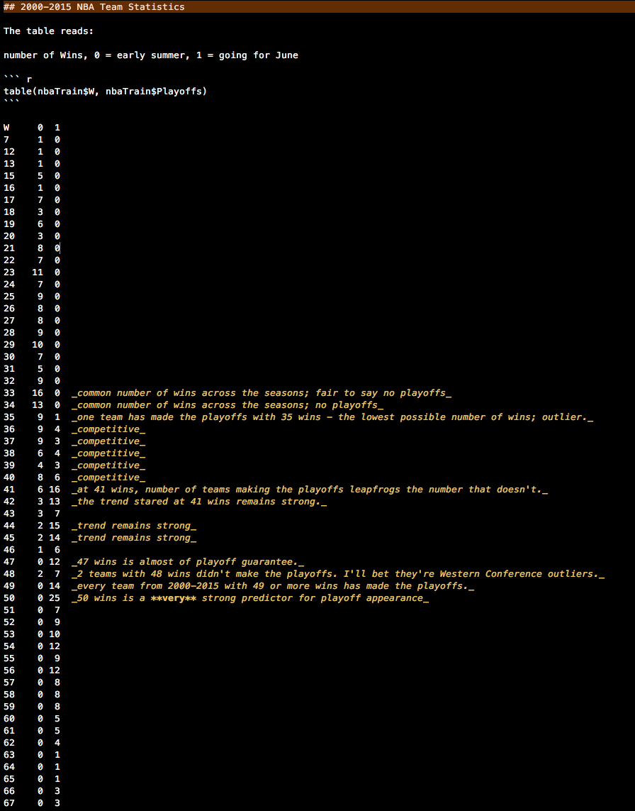

# Notes

- [Step by Step](#step-by-step)


# Step by Step

**How many regular season wins does an NBA team need to have a strong chance at making the playoffs?**

After splitting the data into training (2000-2015) and test (2016) sets, making a table of Wins vs. Playoff Appearances gives a sense of how many wins a team needs for a strong shot at making the playoffs. 

``` r
table(nbaTrain$W, nbaTrain$Playoffs)
```



It looks like at 41 wins and above, chances that a team will make the playoffs improve dramatically. At 42 wins and above, the number of teams not making the playoffs becomes a distinct minority, and above 48 wins practically guarantees a playoff spot. 

**How many points does a team need to win by - on average - to have a strong chance at a W?** 

This is the Point Differential (`ptsDIFF`), and it's calculated seasonally from each team's point totals. Simple formula: 

	Points Scored minus Points Allowed = Points Differential

So the two questions above break down the prediction method: how many wins does a team need, and how many wins will a team likely get? We can see from the a quick correlation matrix, Wins and Point Differential are pretty highly correlated:


``` r
corrplot(nbaTrain.cor, method = "shade", tl.srt = 45, tl.cex = 0.85, 
         title = "Correlation Matrix of Traditional NBA Statistics: 2000-2015", 
         addCoef.col = "black", number.cex = 0.65, mar = c(2, 2, 2, 2))
```

With a correlation coefficient of 0.96, Wins and Point Differential exhibit a near-certain positive linear relationship.
Other strongly correlated variables are to be expected, such as that between 3P field goals and 3P field goals attempted. 

# Wins-Point Differential model

To predict the number of points a team will need to win by (on average) to make the playoffs, we'll need to fit a model using Wins and Point Differential so we can make our calculations.

``` r
RegSeasonW <- lm(W ~ ptsDIFF, data = nbaTrain)
summary(RegSeasonW)
#     Coefficients:
#                   Estimate Std.Error  t-value   Pr(>|t|)    
#     (Intercept) 4.049e+01  1.595e-01  253.93    <2e-16 ***
#     ptsDIFF     3.301e-02  4.411e-04   74.84    <2e-16 ***

# Multiple R-squared:  0.9221,	Adjusted R-squared:  0.922 
```

That's a pretty nice r^2 there. 


# Sum of Squared Error Calculation

``` r
SSE <- sum()
```