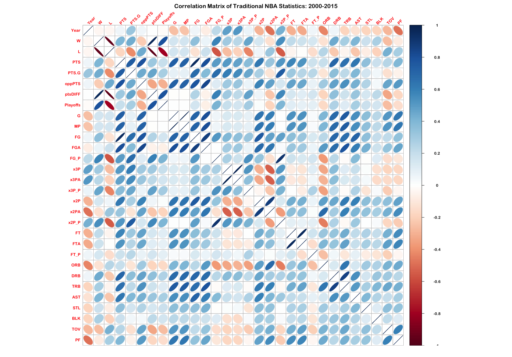
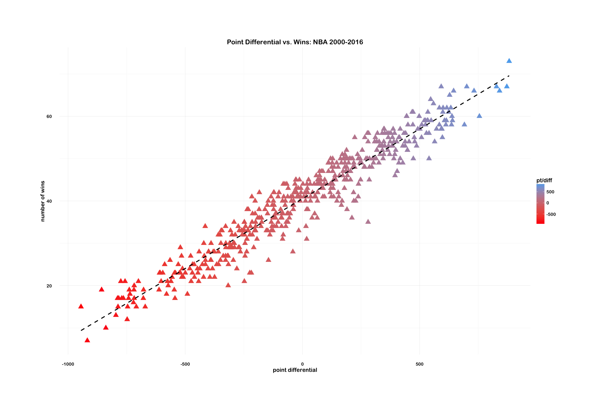

NBA 2k17
========

_student work in R_

# The Playoff Question

1. How many wins does a team need in order to make the playoffs? 
2. How many points does a team need to win by (point differential) in order to reach the number of wins established in the first question?

Looking at data from 2000-2016, the low cutoff for Wins needed to make the playoffs is 41. At this cutoff, things are still competetitive. Above 47 wins is a near guaranteed playoff spot - only twice in 16 years has a team won 47 or more games and not made the playoffs. I'd have to check again but I bet they were Western Conference. 

But using 41 wins as the playoff cutoff - it seems that a team that can achieve a point differential in the range of +175-182 will have a strong chance at making the playoffs. Over 82 games, this translates to a team winning by 2 or more points per game. Of course not every game is decided by a single basket margin - and there will be a distribution of wins and losses. In a 41 Win model, losing by no more than 4 points and winning by 4 points or more is the most desirable outcome.

# Linear Regression

- [the code](nba2k17.R), in progress. (need prediction on test data after choosing model)
- [notes](notes.md) in detail for reference. 

What follows is a basic, off-the-shelf linear regression to predict the number of cumulative points a team will need to score to make the NBA playoffs for the 2016-17 season. 

This is a **very** simple linear regression on some **very** simple data (read: no advanced metrics, no polynomial regressions). It's not trying to make the firmest real-world predictions, and also doesn't take into account the Draft or recent free agency moves that could easily throw the balance of the league off (\*cough*, _Durant_).

Going to be following the steps outlined in this [MIT/EdX](https://www.youtube.com/watch?v=WfaKNYR2vAA) lecture with some possibility for freestyling on the framework if I'm feeling like opening up the statistics book. I know MIT profs have more important things to do than know the difference between _baseball_ and _basketball_, but I still find it funny that this recitation used the two terms interchangeably. 

# the Data

[Basketball-Reference](http://basketball-reference.com) is an amazing resource, but their statistics don't always come ready to plug right into R. For instance, Wins/Losses are in a different table from traditional statistics. On top of that, team records are divided by conference while the trad stats are one table of all 30 teams. So! Because of all this, I ended up downloading 3 different CSV for each season from the site - one for team stats, one for opponent stats, and one for the standings. 

This is not to say anything against Basketball-Reference - but more to point out for a specific analysis within a specific programming language, it won't always be a plug-and-play situation.

The cleaning, binding, and cleaning script is [here](nba2k17-bind.R).

## Exploratory

correlations between variables? added ptsDIFF variable, for point differential...

...which as Moneyball has proven, is a pretty strong indicator/estimator/predictor of Wins:

## since 2000

the [NBA Rulebook](NBA-rulebook-00.md) - amendments by year.

It's been said often that the league has gotten 'soft' since the 1990s- meaning, among many things, that defensive rules have changed in favor of higher scoring games. An immediate example that comes to mind is the reinstatement of zone defense (3 second defensive caveat). Others include hand-checking. 

So the [rulebook amendments](http://www.nba.com/analysis/rules_history.html) since 2000 are here for further research into which intervals in the NBA might've had effects on scoring.

